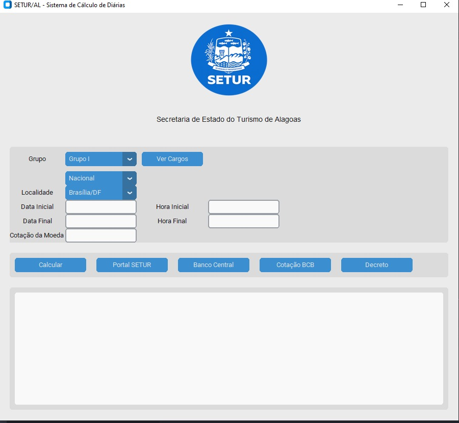

# :computer:  Automação do cálculo e da concessão de diárias


<p align="center">
  
</p>

## :clipboard: Descrição da Aplicação


 A aplicação foi desenvolvida para auxiliar a equipe da Secretaria de Estado do Turismo de Alagoas (SETUR/AL) no cálculo e na concessão de diárias, seguindo as regras estabelecidas na cartilha elaborada pelo **Superintendente de Finanças e Orçamento**, com base no *Decreto Estadual nº 90.173, de 17 de março de 2023.*

---

#### :shipit: Funcionalidades:

- Cálculo de diárias nacionais
- Cálculo de diárias internacionais
- Conversão por cotação
- Aplicação das regras do decreto
- Cálculo de pernoite
- Exibição dos cargos por grupo
- Consulta ao Banco Central
- Consulta ao Decreto
- Registro de auditoria
- Interface gráfica em CustomTkinter

---

## :open_file_folder: Organização do Projeto

```text
app-diarias/
│
├── image/                      # Recursos visuais
│   ├── logo_setur.ico          # Ícone do aplicativo
│   ├── logo_setur.png          # Logo da SETUR
│   └── tela_inicial.png        # Captura da tela inicial
│
├── src/                        # Código-fonte
│   │
│   ├── constantes/             # Configurações e constantes
│   │   ├── config.py           # Configurações e valores das diárias
│   │   └── links.py            # Links oficiais
│   │
│   ├── interface/              # Interface gráfica
│   │   └── app.py              # Janela principal do sistema
│   │
│   └── utils/                  # Funções auxiliares
│       ├── diarias.py          # Cálculo das diárias
│       ├── formatadores.py     # Formatação de valores
│       └── logger.py           # Auditoria e geração de logs
│
├── .gitignore                  # Arquivos e pastas ignorados pelo Git
├── LICENSE                     # Licença do projeto
├── main.py                     # Arquivo principal
├── README.md                   # Documentação
└── requirements.txt            # Dependências
```

## :hammer_and_wrench: Requisitos de Instalação


### 1. Clone o repositório

```bash
git clone https://github.com/Alotrpyco/app-diarias.git
```

### 2. Acesse a pasta do projeto

```bash
cd app-diarias
```

### 3. Crie um ambiente virtual

**Windows**

```bash
python -m venv .venv
```

**Linux/macOS**

```bash
python3 -m venv .venv
```

### 4. Ative o ambiente virtual

**Windows (PowerShell)**

```powershell
.venv\Scripts\Activate.ps1
```

**Windows (CMD)**

```cmd
.venv\Scripts\activate
```

**Linux/macOS**

```bash
source .venv/bin/activate
```

### 5. Instale as dependências

```bash
pip install -r requirements.txt
```

---

## ▶️ Executando a aplicação

```bash
python main.py
```

---

## 📦 Gerando o executável

Caso deseje gerar um arquivo `.exe`:

```bash
pyinstaller --onefile --windowed --icon=image/logo_setur.ico main.py
```

O executável será criado na pasta:

```text
dist/
└── main.exe
```

---

Para verificar a documentação completa da interface gráfica, acesse: [CustomTkinter](https://github.com/TomSchimansky/CustomTkinter)

---

## :statue_of_liberty: Autor:

**Sérgio Ricardo Vieira Torres Silva**      
  [](mailto:sergio.torres@feac.ufal.br) 
  [](https://www.instagram.com/sergioricardo.me/)
<a href="https://www.op.gg/summoners/br/Alotr%C3%B3pico">
  
</a>
